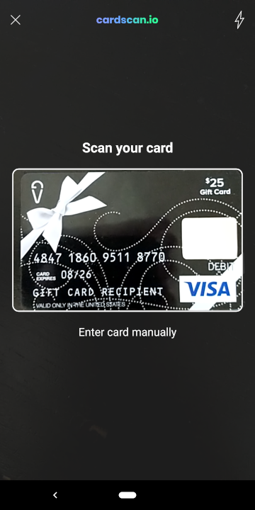

# Overview

This repository contains the camera framework to allow scanning cards. [CardScan](https://cardscan.io/) is a relatively small library (1.9 MB) that provides fast and accurate payment card scanning.

Note this library does not contain any user interfaces. Another library, [CardScan UI](https://github.com/getbouncer/cardscan-ui-android) builds upon this one any adds simple user interfaces. 



## Contents

* [Requirements](#requirements)
* [Demo](#demo)
* [Installation](#installation)
* [Using this library](#using-this-library)
* [Developing this library](#developing-this-library)
* [Authors](#authors)
* [License](#license)

## Requirements

* Android API level 21 or higher
* Kotlin coroutine compatibility

Note: Your app does not have to be written in kotlin to integrate scan-camera, but must be able to depend on kotlin functionality.

## Demo

An app demonstrating the basic capabilities of scan-camera is available in [github](https://github.com/getbouncer/cardscan-demo-android).

## Installation

Theses libraries are published in the [jcenter](https://jcenter.bintray.com/com/getbouncer/) repository, so for most gradle configurations you only need to add the dependencies to your app's `build.gradle` file:

```gradle
dependencies {
    implementation 'com.getbouncer:scan-camera:2.0.0014'
}
```

## Using this library

This library is designed to be used with [CardScan UI](https://github.com/getbouncer/cardscan-ui-android), which will provide user interfaces for scanning payment cards. However, it can be used independently.

For an overview of the architecture and design of the scan framework, see the [architecture documentation](https://github.com/getbouncer/scan-framework-android/blob/master/docs/architecture.md).

### Getting images from the camera

Let's use an example where we stream images from the camera.

```kotlin
class MyCameraAnalyzer : AppCompatActivity(), CameraErrorListener {

    private val cameraAdapter by lazy {
        Camera2Adapter(
            activity = this,
            previewView = textureView, // A TextureView  where preview with display. If null, no preview will be shown.
            minimumResolution = MINIMUM_RESOLUTION, // the minimum image resolution that should be streamed.
            cameraErrorListener = this
        )
    }
    
    /**
     * Call this method to start streaming images from the camera.
     */
    fun startStreamingCamera() {
        cameraAdapter.bindToLifecycle(this)
    }

    /**
     * Call this method to get a stream of images from the camera.
     */
    fun getCameraImageStream() = cameraAdapter.getImageStream()

    override fun onCameraOpenError(cause: Throwable?) {
        // The camera could not be opened
    }

    override fun onCameraAccessError(cause: Throwable?) {
        // The camera could not be accessed
    }

    override fun onCameraUnsupportedError(cause: Throwable?) {
        // the camera is not supported on this device.
    }
}
```

## Developing this library

See the [development documentation](docs/develop.md) for details on developing this library.

## Authors

Adam Wushensky, Sam King, and Zain ul Abi Din

## License

This library is available under paid and free licenses. See the [LICENSE](LICENSE) file for the full license text.

### Quick summary
In short, this library will remain free forever for non-commercial applications, but use by commercial applications is limited to 90 days, after which time a licensing agreement is required. We're also adding some legal liability protections.

After this period commercial applications need to convert to a licensing agreement to continue to use this library.
* Details of licensing (pricing, etc) are available at [https://cardscan.io/pricing](https://cardscan.io/pricing), or you can contact us at [license@getbouncer.com](mailto:license@getbouncer.com).

### More detailed summary
What's allowed under the license:
* Free use for any app for 90 days (for demos, evaluations, hackathons, etc).
* Contributions (contributors must agree to the [Contributor License Agreement](Contributor%20License%20Agreement))
* Any modifications as needed to work in your app

What's not allowed under the license:
* Commercial applications using the license for longer than 90 days without a license agreement. 
* Using us now in a commercial app today? No worries! Just email [license@getbouncer.com](mailto:license@getbouncer.com) and we’ll get you set up.
* Redistribution under a different license
* Removing attribution
* Modifying logos
* Indemnification: using this free software is ‘at your own risk’, so you can’t sue Bouncer Technologies, Inc. for problems caused by this library

Questions? Concerns? Please email us at [license@getbouncer.com](mailto:license@getbouncer.com) or ask us on [slack](https://getbouncer.slack.com).
