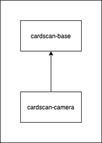

# Development

cardscan-camera development guide

## Contents

* [Dependencies](#dependencies)
* [Architecture](#architecture)
* [Building](#building)
* [Running Unit Tests](#running-unit-tests)
* [Using Running Android Tests](#running-android-tests)
* [Releasing](#releasing)

## Dependencies

CardScan requires kotlin coroutine libraries for handling concurrency. Note that your app does not need to be written in kotlin to work with CardScan; The [demo app](https://github.com/getbouncer/cardscan-demo-android) is written in Java.

## Architecture

For an overview of the architecture and design of the cardscan framework, see the [architecture documentation](https://github.com/getbouncer/cardscan-base-android/blob/master/docs/architecture.md).

## Code Organization

CardScan Camera consists of these modules:
* [cardscan-base](https://github.com/getbouncer/cardscan-base-android)
* [cardscan-camera](https://github.com/getbouncer/cardscan-camera-android)



### cardscan base

[CardScan Base](https://github.com/getbouncer/cardscan-base-android) contains the framework and machine learning models used to scan cards. See the [architecture document](https://github.com/getbouncer/cardscan-base-android/blob/master/docs/architecture.md) for details on how CardScan processes images from the camera.

### cardscan camera

[CardScan Camera](https://github.com/getbouncer/cardscan-camera-android) contains the camera interfaces for setting up the camera on the device and receiving images from it. It also handles converting the images from the camera to a processable format.

## Building

Check out the project using `git`. Note that this project makes use of submodules, so a `recursive` clone is recommended.
```bash
git clone --recursive https://github.com/getbouncer/cardscan-camera-android
```

To build the project, run the following command:
```bash
./gradlew cardscan-camera:build
```

To create an AAR release of the library, run the following command:
```bash
./gradlew cardscan-camera:assembleRelease
```
This will place an AAR file in `cardscan-camera/build/outputs/aar`

## Contributing

CardScan libraries follow a standard github contribution flow.

1. Create a new github feature branch
    ```bash
    git checkout -b <your_github_name>/<your_feature_name>
    ```

1. Make your code changes

1. Push your branch to origin
    ```bash
    git push --set-upstream origin <your_branch_name>
    ```

1. Create a new pull request on github, and tag appropriate owners.

1. Once you have approval, merge your branch into master and delete your feature branch from github.

## Running Unit Tests

Unit tests can be run from android studio or from the command line. To execute from the command line, run the following command:
```bash
./gradlew test
```

## Running Android Tests

Android tests can be run from android studio or from the command line. To execute from the command line, run the following from the base directory:
```bash
./gradlew connectedAndroidTest
```

Note that these tests require that you have an emulator running or a physical device connected to your machine via `ADB`.

## Releasing

See the [release](release.md) documentation.
